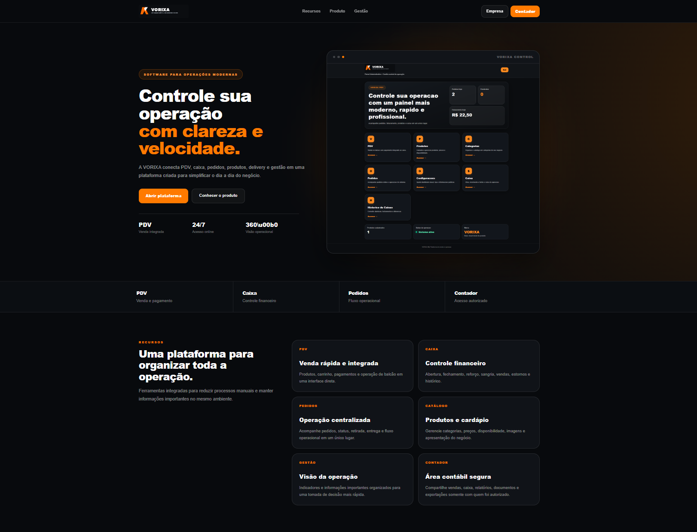
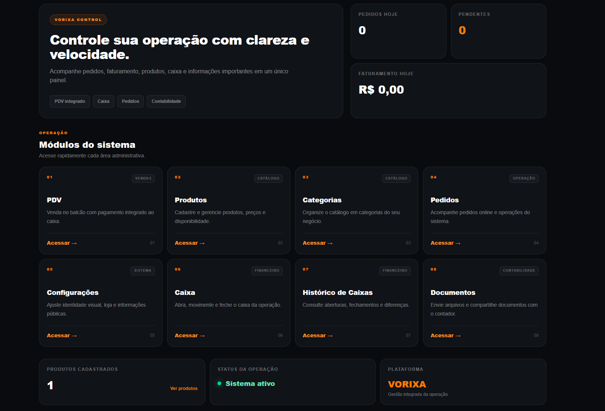
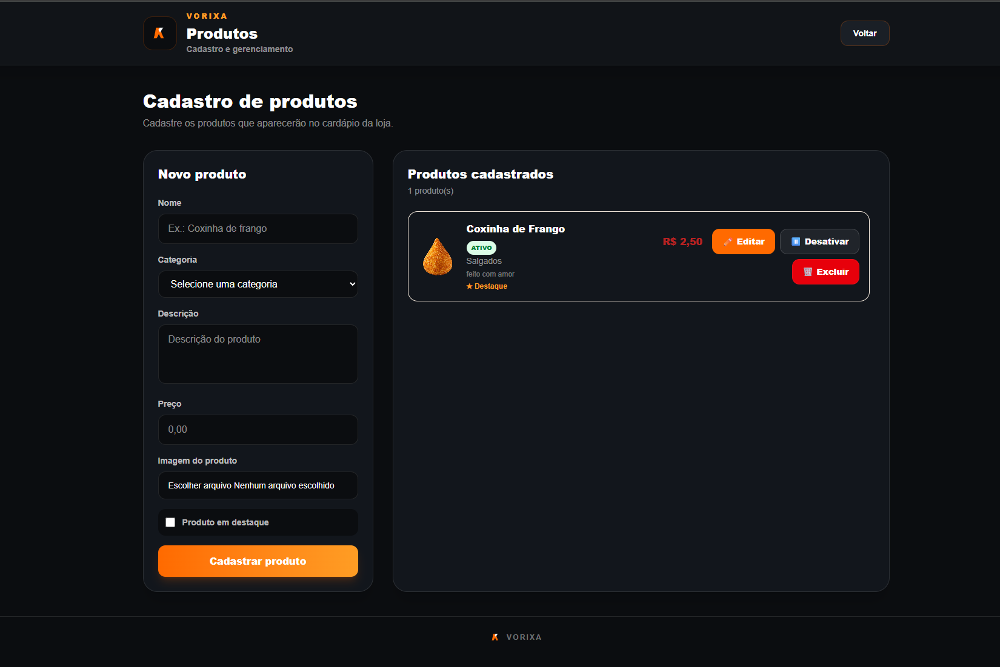
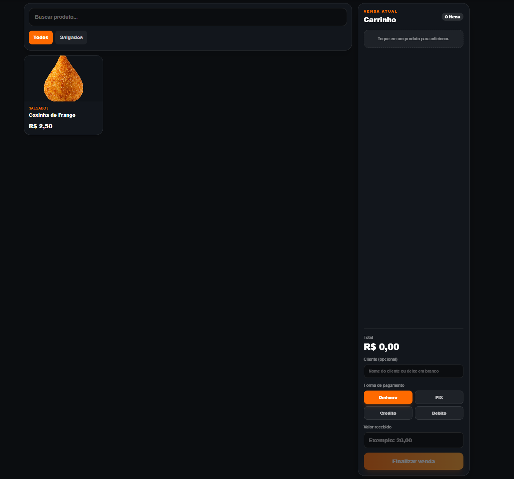
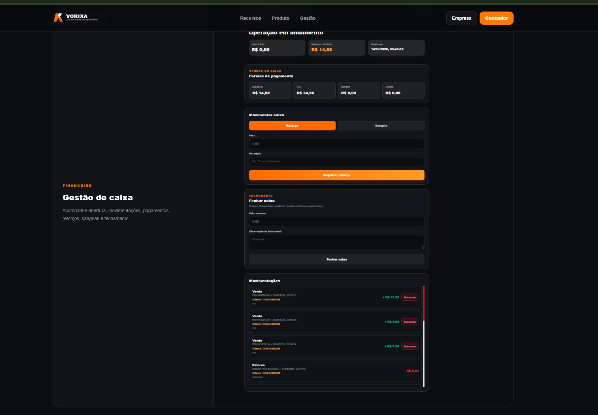
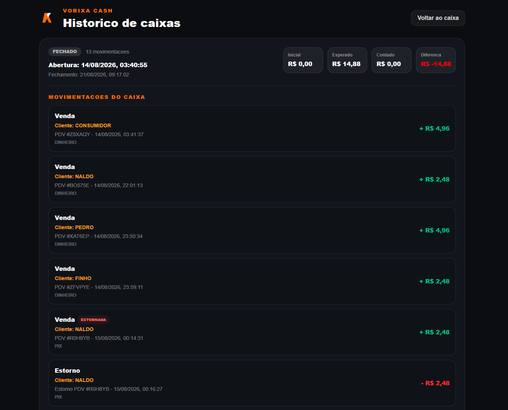
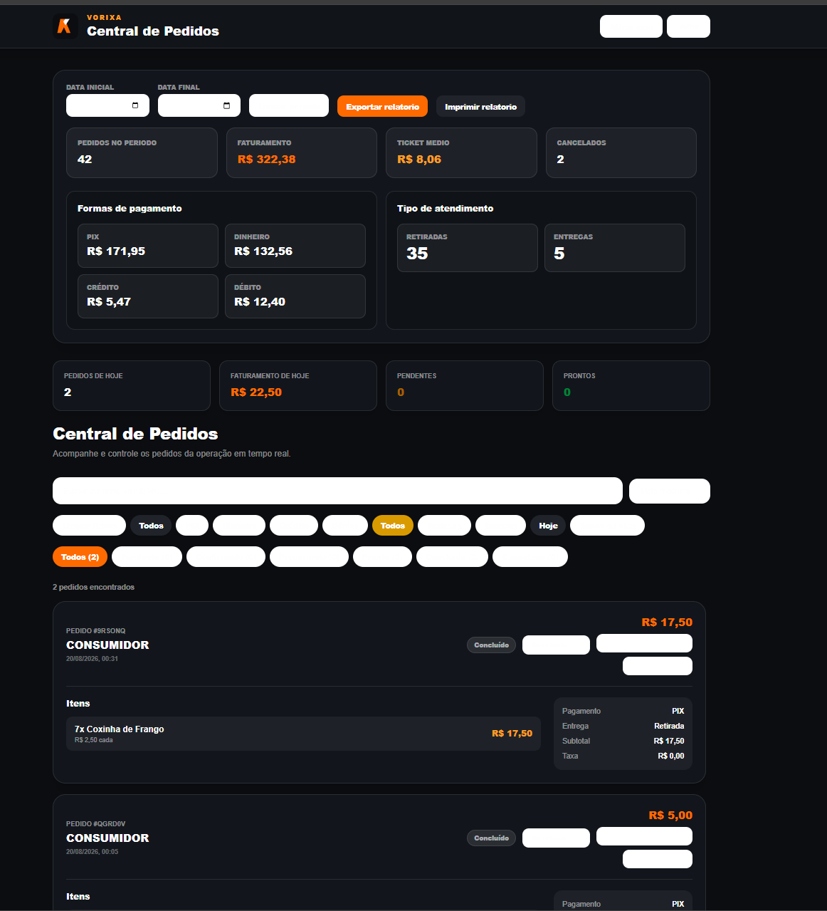
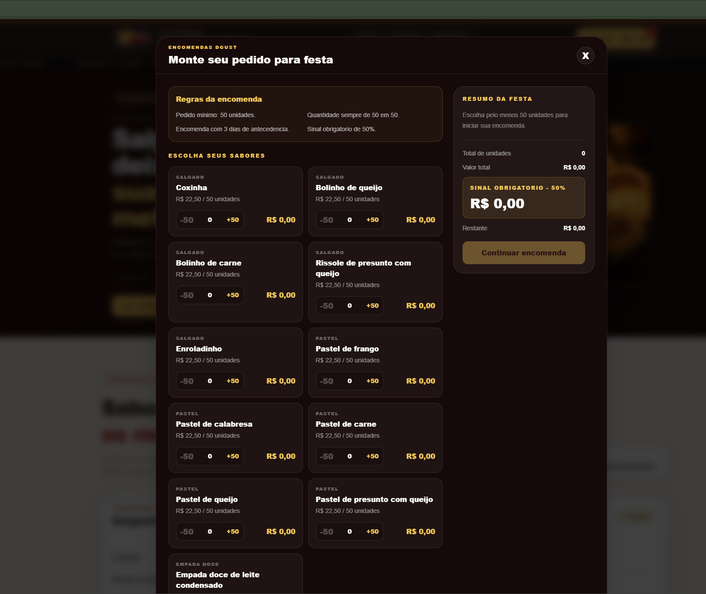
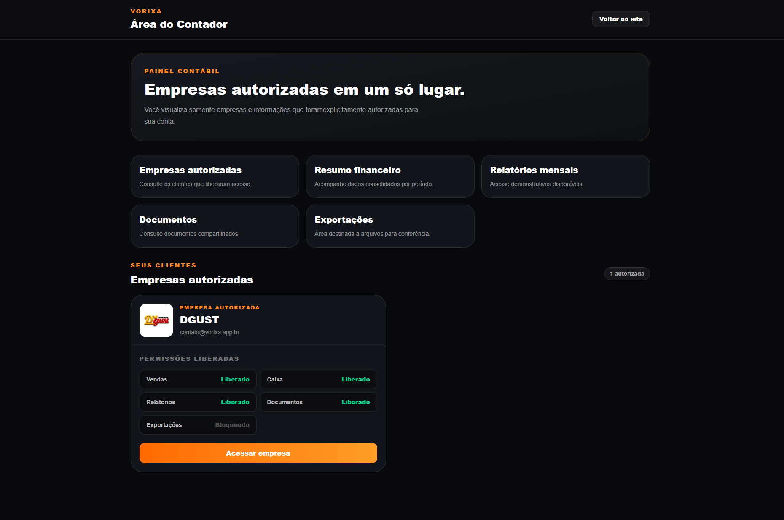
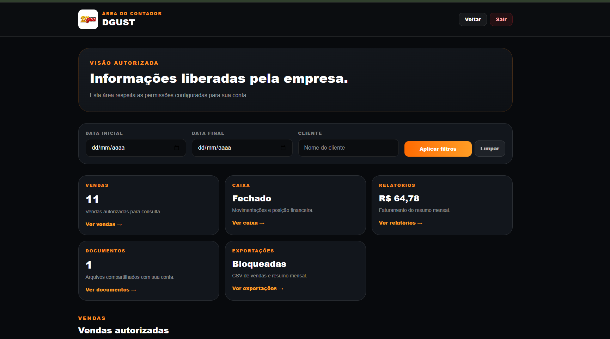

# VORIXA — Sistema de PDV, Delivery e Gestão Comercial

## Código e propriedade

O código-fonte principal é mantido em repositório privado para proteger regras comerciais, configurações e dados do sistema. Este repositório público apresenta as funcionalidades, tecnologias e interfaces desenvolvidas.

## Situação atual

| Módulo | Situação |
|---|---|
| Cardápio digital | Funcionando |
| Painel administrativo | Funcionando |
| Produtos e categorias | Funcionando |
| Pedidos e delivery | Funcionando |
| PDV | Funcionando |
| Caixa e histórico | Funcionando |
| Encomendas para festas | Funcionando |
| Área do contador | Funcionando |
| Documentos e relatórios | Funcionando |
| Aplicativo Stone | Em desenvolvimento |
Sistema desenvolvido para administrar vendas, pedidos, produtos, caixa e delivery de pequenos e médios estabelecimentos.

## Sobre o projeto

O VORIXA nasceu de uma necessidade real da Salgadaria DGUST. O projeto reúne cardápio digital, painel administrativo, PDV e controle de caixa em um único sistema.

## Principais funcionalidades

- Cardápio digital responsivo
- Painel administrativo protegido por login
- Cadastro de produtos e categorias
- Controle de pedidos e delivery
- PDV para registro de vendas
- Abertura e fechamento de caixa
- Sangria, suprimento, estorno e movimentações
- Impressão de comprovantes
- Histórico de vendas e sessões do caixa
- Área exclusiva para contador
- Controle de empresas autorizadas e permissões
- Compartilhamento seguro de documentos
- Relatórios financeiros e exportações
- Sistema de encomendas para festas
- Estrutura preparada para múltiplas empresas
- Integração entre PDV, pedidos e caixa
- Acompanhamento do pedido pelo cliente
- Interface responsiva para computador e celular
- Aplicativo para terminal Stone em desenvolvimento

## Tecnologias utilizadas

- Next.js
- React
- TypeScript
- Prisma ORM
- PostgreSQL e SQLite
- Tailwind CSS
- APIs REST
- Autenticação com cookies e senha criptografada
- Git e GitHub
- Android, Java 17 e Gradle

## Diferenciais do projeto

- Desenvolvido a partir das necessidades de um negócio real
- Integração entre atendimento, vendas, pedidos e gestão financeira
- Controle de acesso para administradores e contadores
- Interface responsiva para computador e celular
- Identidade visual personalizável por empresa
- Aplicativo para terminal Stone em desenvolvimento

## Experiência demonstrada

Este projeto demonstra experiência prática com desenvolvimento full stack, criação de interfaces responsivas, autenticação, APIs, banco de dados, regras comerciais, controle financeiro, Git e GitHub.

## Objetivo

Oferecer uma solução moderna, segura e acessível para estabelecimentos que precisam controlar vendas, pedidos, caixa e atendimento em uma única plataforma.

## Desenvolvedor

**Francinaldo dos Santos Oliveira — Naldinho**

Desenvolvedor de software com experiência prática na criação de sistemas comerciais, aplicações web responsivas, APIs, bancos de dados e integração com terminais Android.

## Situação do projeto

Projeto em desenvolvimento e utilizado como experiência prática em um negócio real.

> Algumas informações comerciais, credenciais e configurações privadas não estão incluídas neste repositório.

## Demonstração visual

### Site institucional
## Desenvolvedor

**Francinaldo Oliveira — Desenvolvedor Full Stack Júnior**

## Demonstração do sistema

### Site institucional

### Painel administrativo

### Cardápio digital no celular

### Painel administrativo

### Cardápio digital no celular

### Cadastro de produtos

### PDV

### Gestão de caixa

### Histórico de caixas

### Central de pedidos

### Encomendas para festas

### Área do contador

